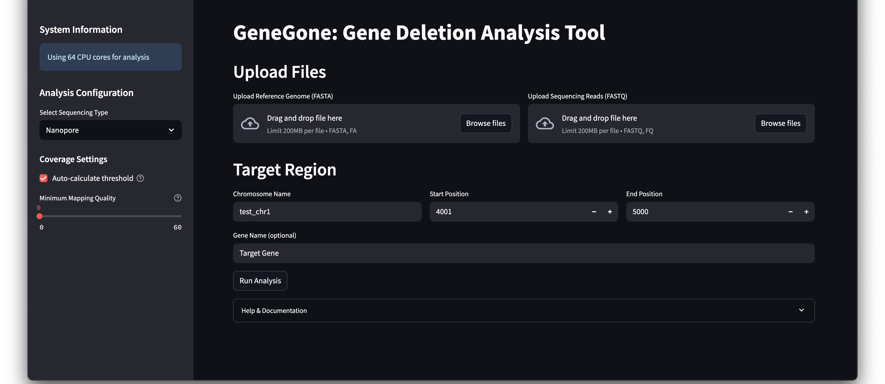
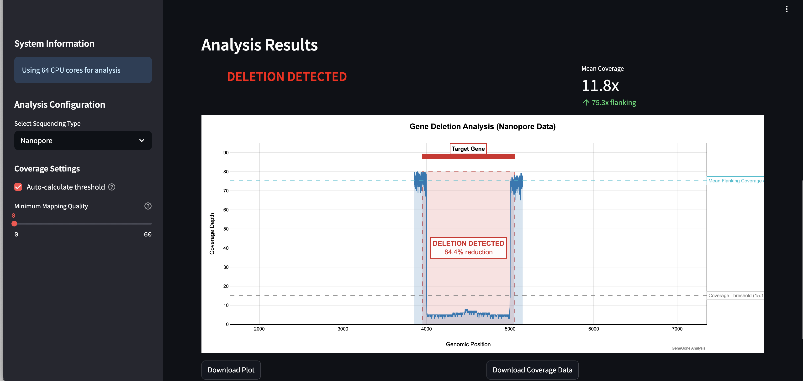

# GeneGone
Web app for checking if gene knockouts worked using sequencing reads and a reference genome
=======
# GeneGone: Gene Deletion Analysis Tool

A tool for analyzing gene deletions. Requires input reads (Illumina, Nanopore, or Pacbio), a reference genome of the wild type that still has the deleted gene and the position of the targeted gene in the reference. The tool aligns the reads against the reference and checks the coverage data to determine if the knockout was successful.


## Features
- Support for multiple sequencing platforms:
  - Oxford Nanopore (ONT)
  - PacBio
  - Illumina
- Platform-specific alignment and analysis parameters
- Interactive coverage visualization
- Automated deletion detection with platform-specific thresholds
- Downloadable analysis results

## Requirements
- Python 3.8+
- Platform-specific aligners:
  - Minimap2 (for Nanopore and PacBio)
  - BWA (for Illumina)
- Samtools (for BAM file processing)

## Installation
1. Clone this repository
2. Install Python dependencies:
```bash
pip install -r requirements.txt
```
3. Install system dependencies:
```bash
# For macOS (using brew)
brew install minimap2 bwa samtools
```


## Usage
1. Start the Streamlit app:
```bash
streamlit run app.py
```
2. Select your sequencing platform (Nanopore, PacBio, or Illumina)




3. Upload your input files:
   - Sequencing reads (FASTQ format)
   - Reference genome (FASTA format)
4. Enter the target gene coordinates
5. Adjust platform-specific parameters if needed
6. Run the analysis

## Platform-Specific Features

### Nanopore
- Optimized for long reads with higher error rates
- Default parameters tuned for ONT data
- Flexible coverage thresholds

### PacBio
- Configured for high-accuracy long reads
- PacBio-specific alignment settings
- Supplementary alignment handling

### Illumina
- Higher mapping quality requirements
- Stricter coverage thresholds
- Additional quality metrics

## Output
- Interactive coverage plot
- Deletion percentage and status
- Mean coverage statistics
- Downloadable coverage data (CSV)




## Contributing
Contributions are welcome! Please feel free to submit a Pull Request.
